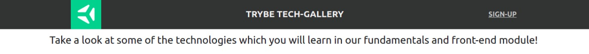

## CSS Flexbox - Parte 1

#### Atividade de fixação:
> Utilizando os arquivos `tech-gallery.html` e `style.js` fornecidos, realize as seguintes modificações para ser similar a imagem abaixo:

Requisito 1 - Crie um cabeçalho para sua aplicação utilizando a tag `header`. Este cabeçalho **deve** possuir 3 elementos e estes devem ser posicionados utilizando **Flexbox**. O resultado deverá ser similar à estrutura da página "Trybe Tech-Gallery". Observe os exemplos abaixo:

Requisito 2 - Implemente o conteúdo da primeira `section`. Esta seção deverá conter no mínimo um elemento de texto. Utilizando **Flexbox**, faça o posicionamento de acordo com o exemplo abaixo.

Requisito 3 - Implemente o posicionamento da segunda `section`. Esta seção deverá conter  no mínimo 6 imagens e um título para cada uma delas. Sinta-se livre para usar a imaginação e selecionar as imagens que preferir, só não esqueça de seguir a estrutura de posicionamento proposta.

Requisito 4 - Por fim, faça o posicionamento do footer/rodapé, este é o ultimo elemento necessário para que nossa aplicação fique completa. O rodapé **deverá** conter no mínimo 2 elementos. Para o exemplo, foram adicionadas imagens que redirecionam o usuário para as redes sociais da Trybe.

