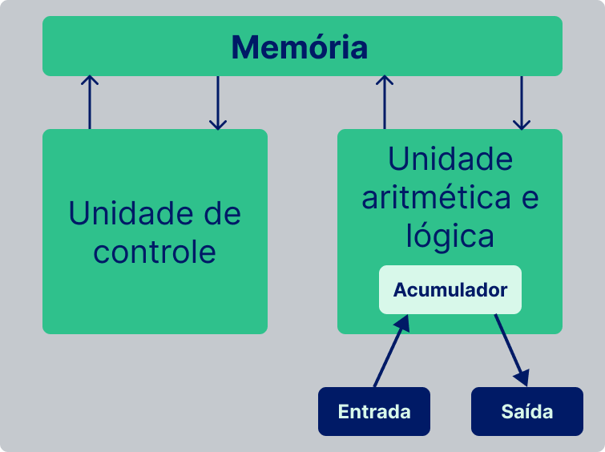

## Estrutura de Dados I: Array, Listas, Filas e Pilhas

Neste bloco foi abordado os principais conceitos da arquitetura básica de computadores; funcionamento básico de uma CPU; funcionamento da memória principal do computador e como o sistemas operacionais atuam nas máquinas. Bem como a introdução a estrutura da dados (`ED`) e tipos abstratos de dados (`TAD`), introduzindo: `arrays` e seu funcionamento em baixo nível, `arrays` multi-dimensionais, `nó`, `lista encadeada`, `pilha` e `fila`.

  

