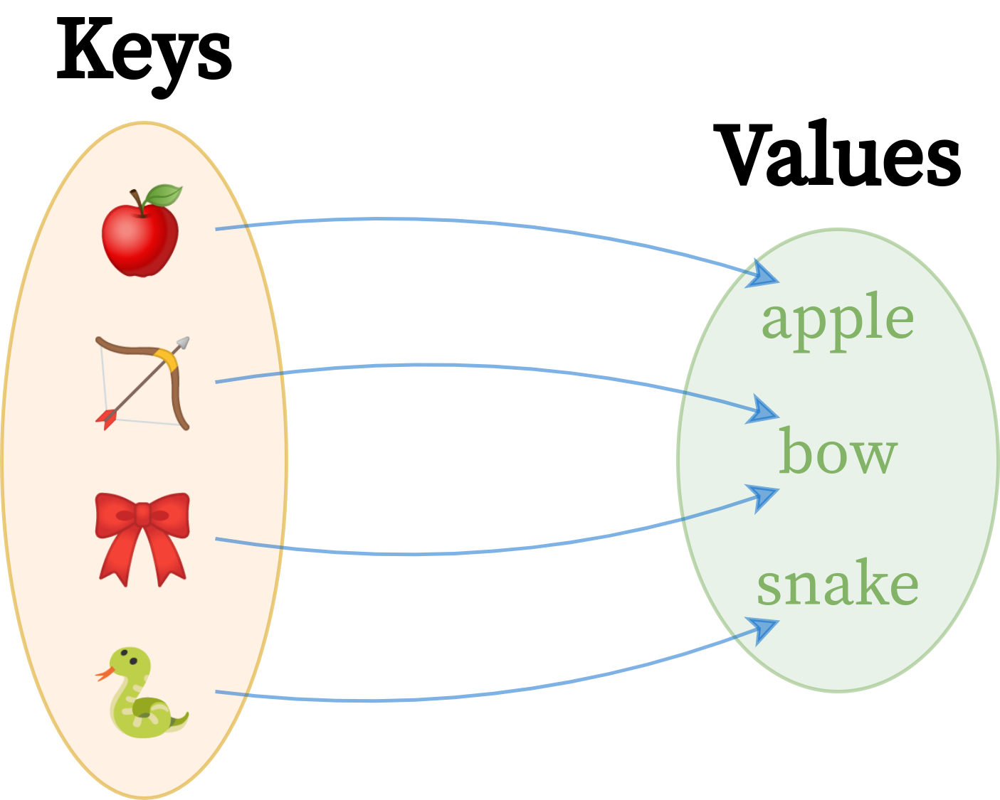

## Estrutura de Dados II: Hashmaps e Sets

Neste bloco foi abordado os conceito de `hashing` e sua aplicação para criação de estruturas eficientes; definição matemática de `conjunto` e suas aplicações básicas; implementação de uma classe `HashMap` e `Set` de forma manualmente; funcionalidade da classe `Dict` e `Set`. 

 

  

